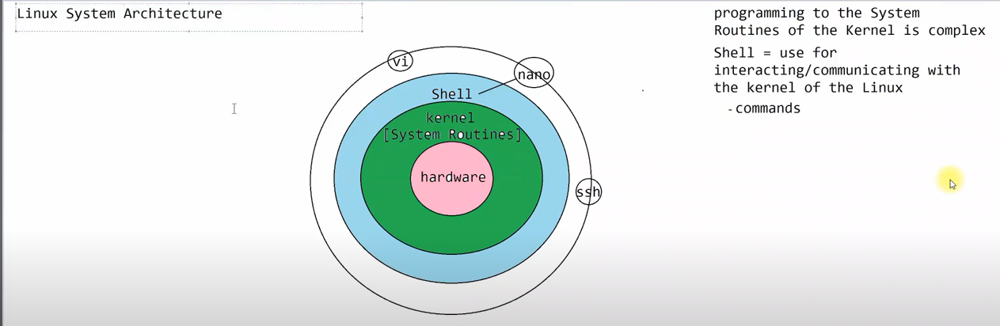

### Hierarchical FileSystem  
- Expressed in terms of parent and child relationship is called Hierarchical. Hierarchical data structures resemble trees and have only one parent at the top.  
- 1. Traverse the files & folders is easy  
- 2. Enforcing the security on group of files and folders  
- 3. Managing the file operations on the group.

### Textual Diagram

This shows the layered architecture from the user down to the hardware.
```markdom
User Space
|
| ---> Shell (Accepts user commands to interact with the kernel)
|
Kernel Space
|
| ---> Kernel (The core of the OS, manages hardware and system routines)
|
| ---> System Routines (The complex internal functions of the kernel)
|
Hardware (The physical components of the computer)
```
---

### Descriptive Explanation

The Linux System Architecture can be visualized as a stack of layers:

1.  **Hardware:** The physical foundation of the system (CPU, RAM, disk, etc.).
2.  **Kernel:** The core of the operating system that resides directly on the hardware. It contains the complex **System Routines** that manage all hardware and critical system functions.
3.  **Shell:** A command-line interface that acts as a bridge between the user and the kernel. Users issue **commands** to the shell, which then communicates those requests to the kernel.
4.  **User/Programs:** This is where users and applications run, "programming to the system" by using the shell and other interfaces to leverage the kernel's capabilities.




---

### Shell

A Shell is a software program / Utility Program that provides a bunch of commands using which we can interact with the kernel of the Linux Operating System. This helps to ease our interactions with Linux.

Basically, there are 2 main types of shells:

**1. Bourne/Bash Shell Family**
*   Bourne (SH)
*   Bourne Again Shell (BASH)
*   Korn Shell
*   POSIX Shell

**2. C Shell Family**
*   C Shell (CSH)
*   TCSH (Tenex Shell)