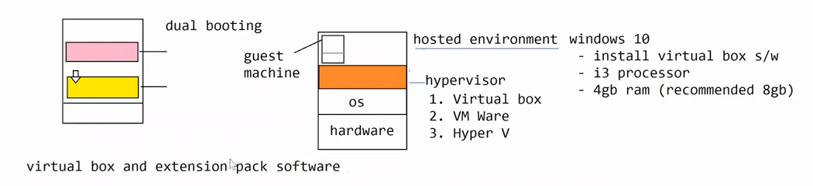

## **Shell** = Software Program/Utility helps us in interacting with kernal of the linux operating system.

#### At high level we have 2 types of Shells.

- **Bourne Shell**
- 1. Bourne Shell (SH)
- 2. Bourne Again Shell (BASH) = its a better version of Bourne Shell (SH)
- 3. Korn Shell
- 4. POSIX [Portable operating system interface]

- **C Shell**
- 1. C Shell - C programming
- 2. TENEXT C (TCSH) = extension C Shell + History, up arrow, down arrow, inline editing

 ### How do we use these Shell in Linux.
- Linux has provided a Terminal Window using which we can run the shell software. Its a Character User Interface
(CUI).

### **Virtualization Softwares**
- Oracle Virtual box
- VM Ware
- Hyper V

### we can create and run mutiple isolated environments on the same physical system

Based on the content of the image, here is the text:

**Virtual box download** - https://download.virtualbox.org/virtualbox/6.1.10/VirtualBox-6.1.10-138449-Win.exe

**Extension pack** - https://download.virtualbox.org/virtualbox/6.1.10/Oracle_VM_VirtualBox_Extension_Pack-6.1.10.vbox-extpack

- extension pack few features will be enabled.
1. Syn folders
2. Network Configurations / Adapters
3. Mount USB Devices

- Virtal box is not 2nd computer,using this we can create another machine.