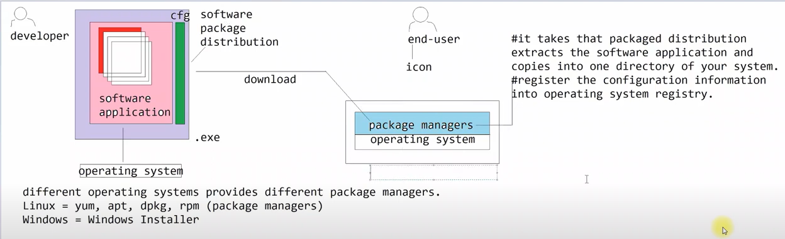

### What is an Operating System?
- acts as an interface between end-user and hardware of the computer along with that it helps us in achieving the hardware portability.

### What is Programming Language?
- programming languages provides english like instruction set that can be used for programming the computer easily. They provide 
  compilers for every platform so that the instructions can be translated into platform executable instructions and can be ran. So that we 
  can run/execute a high level language instruction set on multiple platforms by compiling with platform compilers.

  Based on the content of the image, here is the extracted text:

### What is Linux Operating System?
General Purpose computer operating system
Release - 1991
Linus Trivolds

- Kernel? = core component of linux operating system that interact with the hardware of the computer.
Based on the content of the image, here is the extracted text:
- Linux is defined by "Kernel", and it is not user-friendly and provides CLI for interacting with the Hardware of the computer. To use
Linux one should know the commands and looks like he should be "Programmer". This makes Linux difficult to use and not
categorized as a General Purpose operating system.
- Now the world began to think about how to make Linux easy to use as a End-User Operating System, so an GNU Linux Initiative has begun. GNU (General Public License). Any software that is manufactured under GNU Linux can be freely distributed and can modified.
- Lot of developers around the world started producing different software utilities that can be combined with Kernel that makes it easy to use.
Based on the content of the image, here is the extracted text:

### How to use Linux?
- Install Linux Kernel and Install GNU Software utilities to make it easy to use. Forget about using Linux first of all installation itself is difficult. to make linux easy to install and use Linux Distro has been released.

- Linux Distro?
There are few Software Organizations came forward and started building Linux with GNU Software Utilities and provided as a Linux Operation System. Once we install Linux Distro we get all the things making it easy to use.

- Linux Distro = Linux distro comes with Linux kernal packaged with Software Utilities, GUI and package managers that makes linux easy to use.

- Linux is a general purpose computer operating system, originally released in 1991 by Linus Torvalds. Linux is defined by its “Kernel”, which is the core component of the system.

- The Kernel Interacts with the computer hardware to allow software and other hardware to exchange information.

- Linux was inspired by MINIX which, in turn, was inspired by UNIX.

- Linux is based on the philosophy that software and operating system should be free and freely modifiable. - Linux is distributed on GNU (General Public License).

- The Linux Kernel is more or less same across all the installations of Linux, the software that surrounds the kernel that provides capabilities like software package management, container management, etc. In action of configuration files differs between them.

